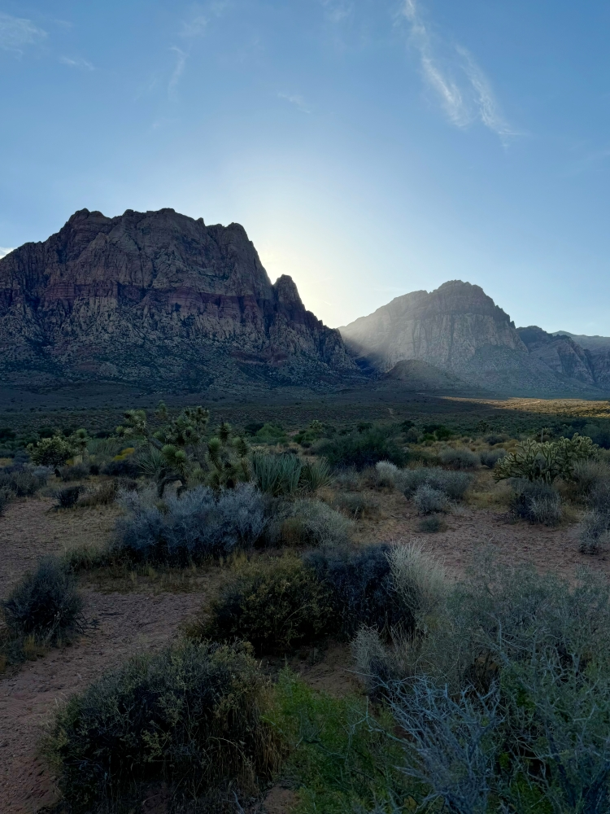

# Summer 2024 -- Aiello

## PRIDE

My summer started with PRIDE! This summer I went to many queer events, conventions, clubs/bars, shows, and I met some famous people (Daniel Franzese, Damian, from Mean Girls). Not only are these events safe spaces fill with pure joy, it always great to randomly see familar faces and friends in these spaces.

## Summer Jamz

There was so many great bops that came out this summer! One of my favorite part of summer is the release of new music, and we got the iconic Brat album from Charli XCX, and Chappell Roan breaking record at summer concerts like Lollapalooza. These are some songs that I had on repeat:

* ["Reason Why" by SOPHIE (feat. Kim Petras and BC Kingdom)](https://open.spotify.com/track/1I4fm6R1YbcLE3DIut2yWu?si=5ee22af4556b437e)

   + I have been a huge fan of SOPHIE since she produced some of Charli XCX tracks. The whole world was devistated when she died in 2018, and make her self a staple in the hyperpop scene before releasing her debut album. Next month they will be releasing her debut album post-humorus, and I am BEYOND stoked here the whole album after the release of this single.

* ["Pink Pony Club by Chappell Roan"](https://open.spotify.com/track/1k2pQc5i348DCHwbn5KTdc?si=1ece9e65397f40e3)

   + Chappell Roan went from a name that name did not know pre-Coachella 2024 and with a explosion of popularity within just a few months is amazing to see from such a talented artist. Her album and Brat were my albums on repeat this summer, like many. This song stuck out the most with the empowing lyrics, and light references to West Hollywood and a life use to live a few years back.

* ["Girl, so confusion featuring Lorde" by Charli XCX](https://open.spotify.com/track/2YFhqZvhTpyK13gKXMKV7R?si=ab573014ca6746aa)

   + Not only was Charli's Brat album iconic, but her promnotion of the album and remixes to follow amped how great an album was already. All the tracks of the album are great, but the remix of "Girl, so confusion featuring Lorde" was a major highlight. The message that the song already had, plus the collab with Lorde and her experiences on how the music industry can pit females artist against each other was a sense of healing we all needed.

* ["I2I (From 'A Whole New Sound') by Magnolia Park" ](https://open.spotify.com/track/3hU1uChF4R0VygUNjcYOJb?si=b9c0990805574a7b)

   + I am a huge fan of the pop punk/hardcore/metalcore sense, growing up in the primetime of Emo/Scene music 2003-2009. I guess Disney is making a pop punk remix of their hit tracks, and when I heard Magnolia Park made a track of "I2I" from The Goofy Movie, my two worlds collided. I hope they release more of the pop-punk remixes, because my ansty Disney kid is calling for some more.

## Digging through Dirt

One of my favorite activities to do these days is go to a thrift store with my partner and friend Morgan. I went thrifting almost every week, usually followed by a visit to one of my favorite parks in central Los Angeles, Barsndall Art Park, which is right next to the thrift store. I revamped most of my wardrobe this summer, and my plan to continue to buy second hand, and donate old unwanted clothes. My two greatest finds this summer was a Prada wallet ($60), and a nice american made leather bag ($20).

## In the Blazing Heat, with such Beautiful Views

<!--  -->

> View of Griffith Observatory from Fountain Ave, Hollywood, CA

> View of Hollywood from Barnsdall Art Park, Hollywood, CA

> View of Red Rock Canyon, Clark County, Nevada

## Summer Sadness

I had a very enjoyable summer, one that started off so free and careless, filled with love, pride and friends. Unfortunately, my summer ended with a lot of sadness and tears. Some may know that my father was not very healthy earlier this year, and was living his last part of his life in my childhood home with my mom. As hard for it for me to accept the reality, he passed away last Friday (August 9th, 2024) on one of the last days of summer. I am still processing my emotions about it, its going to be a rollercoaster for the forseeable future, but I am trying to stay hopeful and not delve down a road of dispair. I can remember fearing growing up and having an older father compared to my peers. I had thoughts that he would never get to see me graduate high school, college, metting my life partner, and even become a teacher like him. With all sadness, I am coping with the fact that the last time I talked to my dad was on Father's day before his health tanked in the up comming weeks. His voice was so joyous, and he was so happy of everything I have done in my life. Even though I didnt get to see him in his final hours of his life, I am holding on to that memory. He was the greatest father I could ever ask for. 